***

# Setup

Now that we have established which methods we wish to evaluate the efficacy of for epidemic forecasting, it is prudent to see how they perform when fitting parameters for a known epidemic model. We have already seen how they perform when fitting parameters for a model with a deterministic evolution process and observation noise, but a more realistic model will have both process and observation noise.

To form such a model, we will take a deterministic SIR ODE model given by

$$
\begin{aligned}
	\frac{dS}{dt} & = - \beta S I  \\
	\frac{dI}{dt} & = \beta S I - \gamma \\
	\frac{dR}{dt} & = \gamma I,
\end{aligned}
$$

and add process noise by allowing $\beta$ to embark on a geometric random walk given by

$$
\beta_{t+1} = \exp \left( \log(\beta_{t}) + \eta (\log(\bar{\beta}) - \log(\beta_{t})) + \epsilon_{t} \right).
$$

We will take $\epsilon_{t}$ to be normally distributed with standard deviation $\rho^2$ such that $\epsilon_{t} \sim \mathcal{N}(0,\rho^2)$. The geometric attraction term constrains the random walk, the force of which is $\eta \in [0,1]$. If we take $\eta = 0$ then the walk will be unconstrained; if we let $\eta = 1$ then all values of $\beta_t$ will be independent from the previous value (and consequently all other values in the sequence).

Choosing an intermediate value of $\eta = 0.5$ gives us

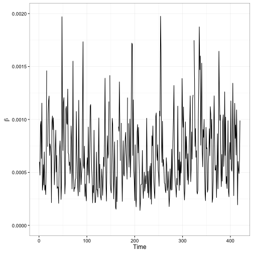 

and corresponding density plot

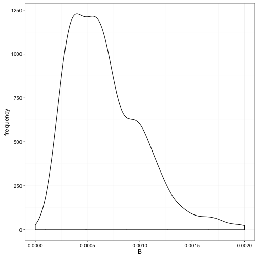 

We see a density plot similar in shape to the desired density, and the geometric random walk displays dependence on previous values.

We arrive at a mean of


```
## [1] 0.0006922973
```

and standard deviation of


```
## [1] 0.0003993207
```

Note that when $\eta \in (0,1)$, we have an autoregressive process of order 1 on the logarithmic scale of the form

$$
X_{t+1} = c + \rho X_t + \epsilon_t
$$

where $\epsilon_t$ is normally distributed noise with mean 0 and standard deviation $\sigma_E$. This process has a theoretical expected mean of $\mu = c / (1 - \rho)$ and variance $\sigma = \sigma_E^2 / (1 - \rho^2)$. For the resulting log-normal distribution these yield a mean of


```
## [1] 0.0006798891
```

and standard deviation


```
## [1] 0.0004458293
```

Which are again very close to the experimentally determined values.

If we take the full stochastic SIR system and evolve it using an Euler stepping scheme with a step size of $h = 1/7$, for 1 step per day, we obtain the following plot

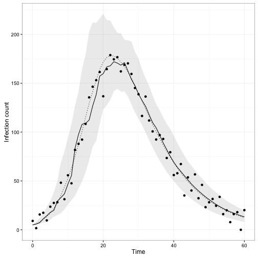 

Here the solid line is a single random trajectory, the dots show the data points obtained by adding in observation error defined as $\epsilon_{obvs} = \mathcal{N}(0,10)$, and the grey ribbon is centre 95th quantile from 100 random trajectories.


***

# Calibrating Samples

In order to compare HMCMC and IF2 we need to set up a fair and theoretically justified way to select the number of samples to draw form the HMCMC iterations and the number of particles to use for IF2. We assume that we are working with a problem that has an unknown real solution, so we use the Monte Carlo Standard Error (MCSE).

Suppose we are using a Monte-Carlo based method to obtain an estimate $\hat{\mu}_{n}$ for a quantity $\mu$, where $n$ is the number of samples. Then the Law of Large Numbers says that $\hat{\mu}_{n} \rightarrow \mu$ as $n \rightarrow \infty$. Further, the Central Limit Theorem says that the error $\hat{\mu}_{n} - \mu$ should shrink with number of samples such that $\sqrt{n} (\hat{\mu}_{n} - \mu) \rightarrow \mathcal{N}(0,\sigma^2)$ as $n \rightarrow \infty$, where $\sigma^2$ is the variance of the samples drawn.

We of course do not know $\mu$, but the above allows us to obtain an estimate $\hat{\sigma}_n$ for $\sigma$ given a number of samples $n$ as

$$
\hat{\sigma}_n = \sqrt{\frac{1}{n} \sum_{i=1}^{n} (X_i - \hat{\mu}) }
$$

which is known as the Monte Carlo Standard Error.

We can modify this formula to account for multiple variables by replacing the single variance measure sum by

$$
\Theta^* V (\Theta^*)^T
$$

where $\Theta^*$ is a row vector containing the reciprocals of the means of the parameters of interest, and $V$ is the variance-covariance matrix with respect to the same parameters. This in effect scales the variances with respect to their magnitudes and accounts for covariation between parameters in one fell swoop. We also divide by the number of parameters, yielding

$$
\hat{\sigma}_n = \sqrt{\frac{1}{n} \frac{1}{P} \Theta^* V (\Theta^*)^T }
$$

where $P$ is the number of particles.

The goal here is to then pick the number of HMCMC samples and IF2 particles to yield similar MCSE values. To do this we picked a combination of parameters for RStan that yielded decent results when applied to the stochastic SIR model specified above, calculated the resulting mean MCSE across several model fits, and isolated the expected number of IF2 particles needed to obtain the same value. This was used as a starting value to "titrate" the IF2 iterations to the same point.

The resulting values were 1000 HMCMC warm-up iterations with 1000 samples drawn post-warm-up, and 2500 IF2 particles sent through 50 passes, each method giving an approximate MCSE of 0.0065.


***

# IF2 Fitting

Now we will use an implementation of the IF2 algorithm to attempt to fit the stochastic SIR model to the previous data. The goal here is just parameter inference, but since IF2 works by applying a series on particle filters we essentially get the average system state estimates for a very small additional computational cost. Hence, we will will also look at that estimated behaviour in addition the the parameter estimates.

The code used here is a mix of R and C++ implemented using RCpp. The fitting was undertaken using $2500$ particles with 50 IF2 passes and a cooling schedule given by a reduction in particle spread determined by $0.975^{p}$, where p is the pass number starting with 0.


The total runtime for the fitting was determined using the R `system.time()` function, and yielded


```
##    user  system elapsed 
##  18.355   0.271  19.438
```

The MLE parameter estimates, taken to be the mean of the particle swarm values after the final pass, were


```
##        R0         r        I0     sigma       eta      berr 
## 3.3106324 0.1031366 7.2199345 8.8893661 0.7614133 0.1133775
```

giving a relative error of


```
##          R0           r          I0       sigma         eta        berr 
##  0.10354413  0.03136561  0.44398689 -0.11106339  0.52282669 -0.77324503
```

From last IF2 particle filtering iteration, the mean state values from the particle swarm at each time step are shown with the true underlying state and data in the plot below

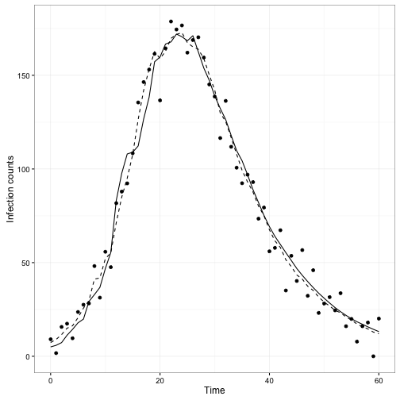 

where the solid line shows the true states, the points are the data, and the dashed line shows the state estimates from the last IF2 filtering pass.

# IF2 convergence plots

Since IF2 is an iterative algorithm where each pass through he data is expected to push the parameter estimates towards the MLE, we can see the evolution of these estimates as a function of the pass number. Plots showing evolution of the mean estimates are shown below for the six most critical parameters.

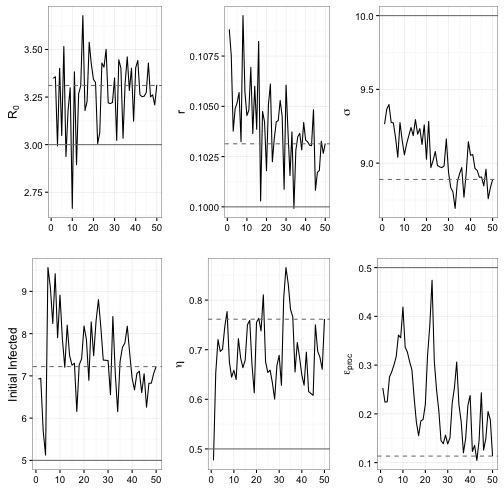 

The horizontal axis shows the IF2 pass number. The solid black lines show the evolution of the ML estimates, the solid grey lines show the true value, and the dashed grey lines show the mean parameter estimates from the particle swarm after the final pass. 

Similarly, we can look at the evolution of the standard deviations of the parameter estimates from the particle swarm as a function of the pass number, shown below.

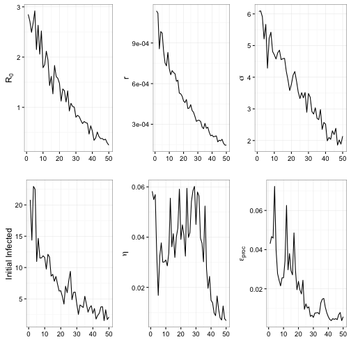 

The horizontal axis shows the IF2 pass number and the solid black lines show the evolution of the standard deviations of the particle swarm values. As expected there is a downward trend in all plots, with a very strong trend in all but two of them.


# IF2 Densities

Of particular importance are the densities of the parameter estimates given by the final parameter swarm. These are shown below.

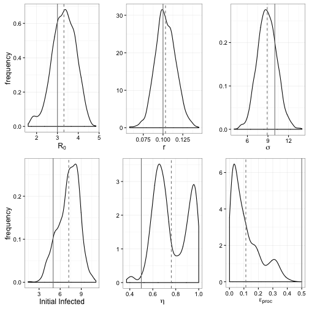 

As before, the solid grey lines show the true parameter values and the dashed grey lines show the density means. It is worth noting that the IF2 parameters chosen were in part chosen so as to not artificially narrow these densities; a more aggressive cooling schedule and/or an increased number of passes would have resulted in much narrower densities, and indeed have the potential to collapse them to point estimates.


# HMC Fitting

We can use the Hamiltonian Monte Carlo algorithm implemented in the `Rstan` package to fit the stochastic SIR model as above. This was done with a single HMC chain of 2500 iterations with 1000 of those being warm-up iterations and a tinning value of 5.


The runtime retrieved again using R's `system.time()` shows


```
##    user  system elapsed 
##  98.152   3.932 106.127
```

which is significantly slower than either the custom IF2 algorithm or the POMP implementation.

The MLE parameter estimates, taken to be the means of the samples in the chain were


```
##         R0          r         I0      sigma        eta       berr 
## 3.31518747 0.09992437 6.64178678 8.49567589 0.45861340 0.16024089
```

giving a relative error of


```
##            R0             r            I0         sigma           eta 
##  0.1050624905 -0.0007562921  0.3283573555 -0.1504324110 -0.0827732048 
##          berr 
## -0.6795182175
```


# HMC Densities

The densities produced by Stan's HMC implementation are shown below:

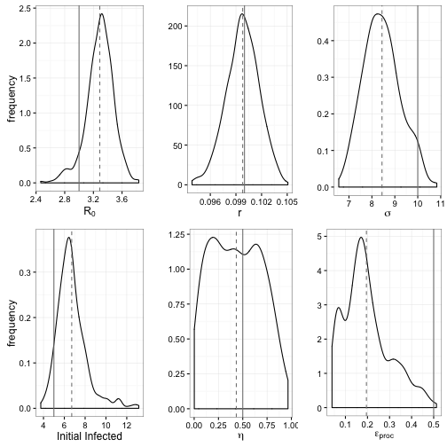 

As before the solid grey lines show the true values and the dashed grey lines show the density means.

It is worth noting that the densities shown here represent a "true" MLE density estimate in that they represent HMC's attempt to directly sample from the parameter space according to the likelihood surface, unlike IF2 which is in theory only trying to get a ML point estimate. Further, these densities are much smoother and potentially more robust than those produced by the custom IF2 implementation.


# HMC Bootstrapping

Unlike particle particle-filtering-based approaches, HMC does not produce state estimates as a by-product of parameter fitting, but we can use information about the stochastic nodes related to the noise in the $\beta$ geometric random walk to reconstruct state estimates. The results of 100 bootstrap trajectories is shown below:

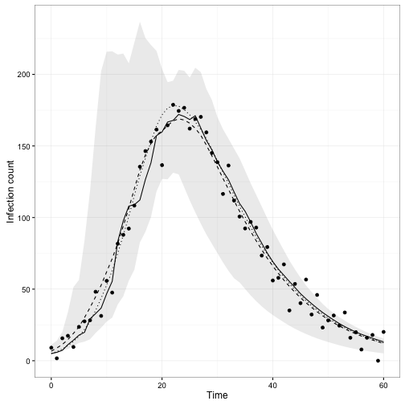 

As before the solid line shows the true states, the dots show the data, the dotted line shows the average system behaviour, the dashed line shows the bootstrap mean, and the grey ribbon shows the centre 95th quantile of the bootstrap trajectories.

***

# Multi-trajectory Parameter Estimation

Here we fit the stochastic SIR model to 1000 _(enough?)_ random independent trajectories using each method and examine the density of the estimates.


First, the average running time over all trajectories for IF2 was


```
## [1] 46.00429
```

And the average running time for the RStan HMCMC fits was


```
## [1] 249.633
```


The density plots for the centre 95% quantiles of IF2 parameters fits are shown below.

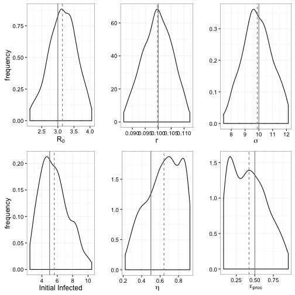 

Here the solid grey lines are the true values, and the dashed grey lines are the density means.


Similarly, the density plots for the centre 95\% quantiles of RStan HMCMC parameters fits are shown below.

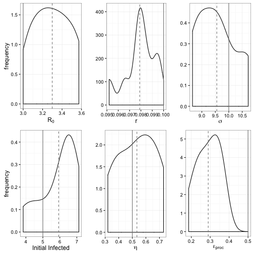 

As before, the solid grey lines are the true values, and the dashed grey lines are the density means.

We can overlay the densities to compare average behaviour, shown in the following plot.

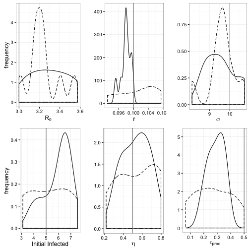 
